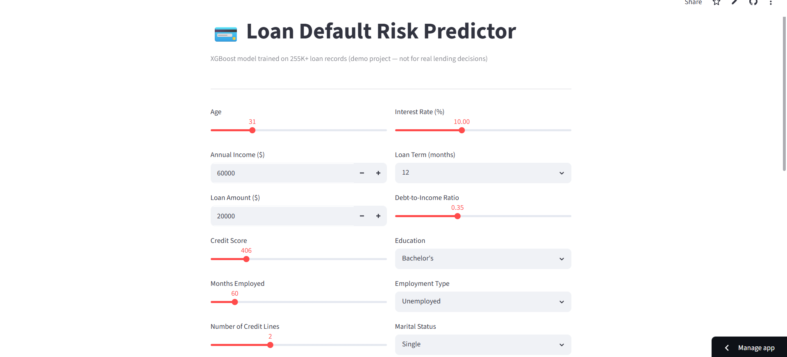
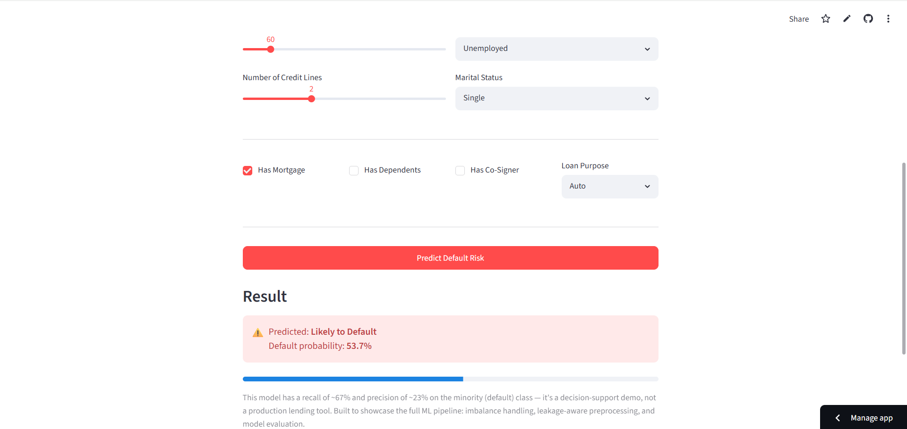

# 💳 Loan Default Risk Predictor

An end-to-end binary classification project predicting loan default risk on a 255K+ record dataset, with a deployed interactive demo.

🔗 **Live App:** [loandefaultprediction-vvuxkummew2cajb8lif7cm.streamlit.app](https://loandefaultprediction-vvuxkummew2cajb8lif7cm.streamlit.app)

---

## 📌 Problem Statement

Predict whether a loan applicant is likely to default, using applicant demographics, income, credit history, and loan terms. The dataset is highly imbalanced — only **11.6%** of loans end in default — which makes naive accuracy-based modeling misleading and requires deliberate handling of class imbalance.

## 🗂️ Dataset

- **255,347 records**, 17 features (after dropping `LoanID`)
- Features: Age, Income, LoanAmount, CreditScore, MonthsEmployed, NumCreditLines, InterestRate, LoanTerm, DTIRatio, Education, EmploymentType, MaritalStatus, HasMortgage, HasDependents, LoanPurpose, HasCoSigner
- Target: `Default` (0 = repaid, 1 = defaulted)
- No missing values, no duplicates

## 🔧 Pipeline

1. **EDA** — distribution analysis, class imbalance check, correlation with target
2. **Preprocessing** — dropped non-predictive ID column, binary-mapped Yes/No fields, one-hot encoded multi-level categoricals
3. **Train/test split first** (stratified, 80/20), *then* scaling/encoding fit only on train — avoids data leakage
4. **Imbalance handling** — compared SMOTE vs. class-weighting; found SMOTE introduces fractional noise into one-hot encoded categorical features, which hurts tree-based models. Used:
   - SMOTE + scaling → Logistic Regression
   - `class_weight='balanced'` → Random Forest
   - `scale_pos_weight` → XGBoost
5. **Model comparison** — Logistic Regression, Random Forest, XGBoost (baseline + tuned via RandomizedSearchCV)
6. **Evaluation** — Precision, Recall, F1, ROC-AUC (prioritized over raw accuracy given the imbalance)

## 📊 Results

| Model | ROC-AUC | F1 | Recall | Accuracy |
|---|---|---|---|---|
| **XGBoost** | **0.7558** | **0.344** | **0.670** | 0.703 |
| Random Forest | 0.7536 | 0.356 | 0.394 | 0.835 |
| Logistic Regression | 0.7531 | 0.338 | 0.691 | 0.685 |
| Tuned XGBoost | 0.7516 | 0.350 | 0.624 | 0.731 |

**XGBoost (untuned)** was selected as the final model — best balance of recall and F1 without the accuracy/recall extremes seen in the other models. The deployed app uses this version.

## 🔍 Key Finding

All three model architectures (linear, bagged trees, boosted trees) converge to a similar ~0.75 ROC-AUC ceiling, and hyperparameter tuning barely moved the score. A class-mean comparison across features confirmed why: defaulters and non-defaulters show very similar distributions on every major feature (differences are less than one standard deviation apart). This indicates the dataset's predictive ceiling is a property of the data itself, not a model or tuning limitation.

## 📸 Screenshots

**Input form**


**Prediction result**


## ⚠️ Disclaimer

This is a **portfolio/demo project**, not a production lending system.

**Design choice — optimized for recall, not precision.** In credit risk, a missed defaulter is far costlier than a false alarm, so this model is tuned to catch **67% of actual defaulters**. The cost of that choice: at this recall level, a meaningful share of flagged applicants will turn out to be safe borrowers — a known and accepted tradeoff in imbalanced classification, not a flaw.

**Why precision is capped here.** The available features (income, age, credit score, interest rate) show limited statistical separation between defaulters and non-defaulters in this dataset — confirmed by comparing class-wise feature distributions. No amount of additional tuning closed this gap across three different model families (Logistic Regression, Random Forest, XGBoost), indicating the ceiling comes from the data itself, not the modeling approach.

**Intended use.** A real-world version of this system would function as a **triage tool** — surfacing higher-risk applications for closer underwriter review — rather than an automated approve/reject engine. Production deployment would require richer behavioral signals (payment history, credit bureau data, prior delinquencies) to meaningfully improve precision.

## 🛠️ Tech Stack

Python · Pandas · scikit-learn · XGBoost · Streamlit

## 📁 Repo Structure

```
├── notebook/credit_risk_prediction.ipynb   # Full analysis and model comparison
├── Screenshot/                               # App screenshots
├── train_and_save.py                        # Trains final XGBoost model, saves artifacts
├── app.py                                    # Streamlit demo app
├── xgb_model.pkl                             # Trained model
├── feature_columns.pkl                       # Feature column order for inference
└── requirements.txt
```

## ▶️ Run Locally

```bash
pip install -r requirements.txt
streamlit run app.py
```
